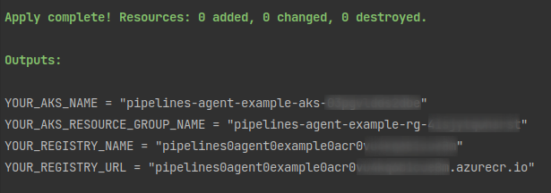

# Self-Host Your Azure Pipeline Agents in Kubernetes and Scale Them On Demand (example)

## Prerequisites
- a kubernetes cluster
- a container registry
- kubectl
- helm
- helmfile

## 00 - Azure Infrastructure (optional)

### Prerequisites
- Terraform
- Azure Subscription

To speed things up, here's the basic infrastructure you need in Azure to get started:
1. Azure Kubernetes Service
2. Azure Container Registry



## 01 - Image

### Prerequisites
- Container registry

Build and push your Pipeline Agent Image with the following commands:

First login to your registry.  For Azure Container Registries, use the following:

`az acr login --name <YOUR_REGISTRY_NAME>`

`docker build -t <YOUR_REGISTRY_URL>/pipeline_agent`

`docker push <YOUR_REGISTRY_URL>/pipeline_agent`

## 02 - Kubernetes

First, authenticate to your k8s cluster and set the context.  If you're using AKS, authentication using the Azure CLI:

`az aks get-credentials -g <YOUR_AKS_RESOURCE_GROUP_NAME> -n <YOUR_AKS_NAME>`

```bash
helmfile \
--state-values-set \
registry.url=<YOUR_REGISTRY_URL>,\
azp.url=<YOUR_AZP_URL>,\
azp.pool=<YOUR_AZP_POOL>,\
pat=<YOUR_AZP_PAT> \
apply
```