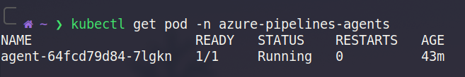
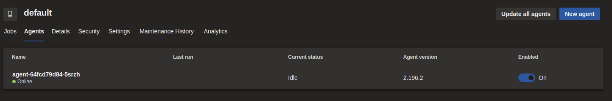
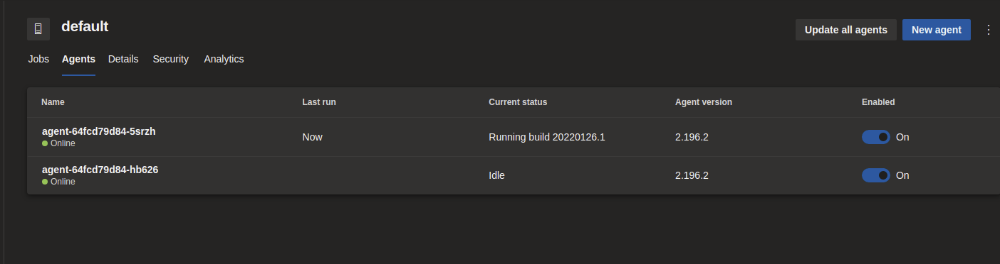

# Self-Host Your Azure Pipeline Agents in Kubernetes and Scale Them On Demand (example)

## 00 - Azure Infrastructure (optional)

If you don't already have your infrastructure setup, you can use this Terraform project to create:
- Azure Kubernetes Service (AKS)
- Azure Container Registry (ACR)
- Access role to pull images from ACR in AKS

### Prerequisites
- [Terraform](https://www.terraform.io/downloads)
- [Azure Subscription](https://azure.microsoft.com/en-ca/free/) with following roles (minimum):
  - Contributor (for creating resources)
  - User Access Manager (for assigning AcrPull role to AKS cluster)


To create the infrastructure, open a terminal in the `./00-infrastructure` directory and execute the following:

```bash
terraform init
terraform apply
```

Once completed, the Terraform will output the required values you will need later on:


## 01 - Image

### Prerequisites
- Container registry (#00)

First login to your registry.  For Azure Container Registries, use the following:

```bash
export YOUR_REGISTRY_NAME=<YOUR_REGISTRY_NAME>
az acr login -n $YOUR_REGISTRY_NAME`
```

The build and push your Pipeline Agent Image with the following commands (from the `./01-image` directory):

```bash
export YOUR_REGISTRY_URL=<YOUR_REGISTRY_URL>
docker build -t $YOUR_REGISTRY_URL/pipeline_agent .
docker push $YOUR_REGISTRY_URL/pipeline_agent
```

## 02 - Kubernetes

### Prerequisites
- Kubernetes cluster with access to your container registry (#00)
- Container registry with agent image (#01)
- [Helm](https://helm.sh/docs/intro/install/)
- [Helmfile](https://github.com/roboll/helmfile#installation)

First, authenticate to your k8s cluster and set the context.  If you're using AKS, authenticate using the Azure CLI:

```bash
export YOUR_AKS_RESOURCE_GROUP_NAME=<YOUR_AKS_RESOURCE_GROUP_NAME>
export YOUR_AKS_NAME=<YOUR_AKS_NAME>
az aks get-credentials -g $YOUR_AKS_RESOURCE_GROUP_NAME -n $YOUR_AKS_NAME
```

Now we'll deploy [KEDA](https://keda.sh/), the agent deployment and KEDA scaler to our k8s cluster.  
Here I'm using Helm combined with Helmfile to install the required Helm repositories and charts to our cluster.

You'll need to provide the following:
- Your Azure Pipelines URL (https://dev.azure.com/YOUR_ORG)
- Your Azure Pipelines pool name (ex: default)
- [Your Azure Pipelines pool ID](https://keda.sh/docs/2.5/scalers/azure-pipelines/#how-to-determine-your-pool-id)
- [Your Personal Access Token (PAT) with Agent Pools (read, manage) scope, created by a user who has permission to configure agents](https://docs.microsoft.com/en-us/azure/devops/organizations/accounts/use-personal-access-tokens-to-authenticate?view=azure-devops&tabs=preview-page)

From the `./02-kubernetes` directory, execute the following:

```bash
export YOUR_REGISTRY_URL=<YOUR_REGISTRY_URL>
export YOUR_AZP_URL=<YOUR_AZP_URL>
export YOUR_AZP_POOL=<YOUR_AZP_POOL>
export YOUR_AZP_POOL_ID=<YOUR_AZP_POOL_ID>
export YOUR_AZP_PAT=<YOUR_AZP_PAT>

helmfile -f ./00-keda.yaml apply
helmfile -f ./01-agent.yaml apply
```

You're done! 🎉
You should now see your agent pod(s) created under the `azure-pipelines-agents` namespace:



They should also be registered as agents in your Azure Pipelines Pool:



## 03 - Test it! (optional)

You can take my word that it works but if you want to test it, here's a easy way.  Create a test pipeline with the following (replace with your pool name):
```yaml
pool:
  name: default

steps:
- checkout: none
- script: |
    waiting for completion
    sleep 30
  displayName: 'wait 30 seconds'
```

Trigger a few consecutive runs and watch your agent get added magically 🪄 to your pool:



After they are done, they should scale back to their minimum required count.